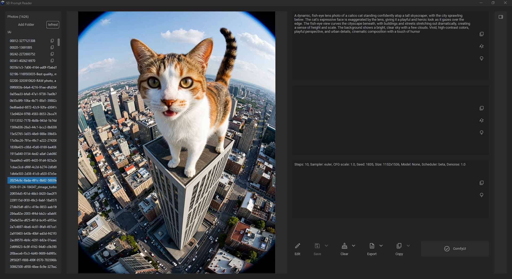
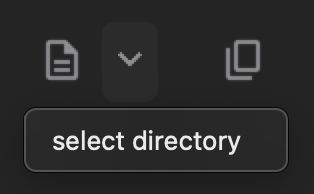
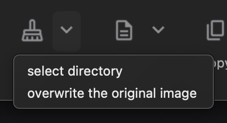
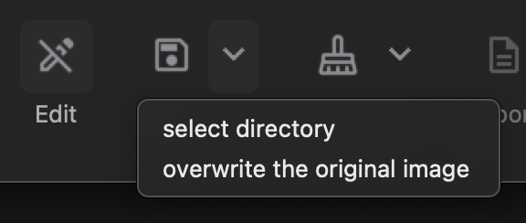
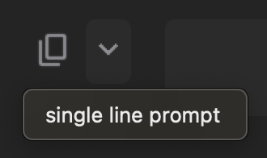
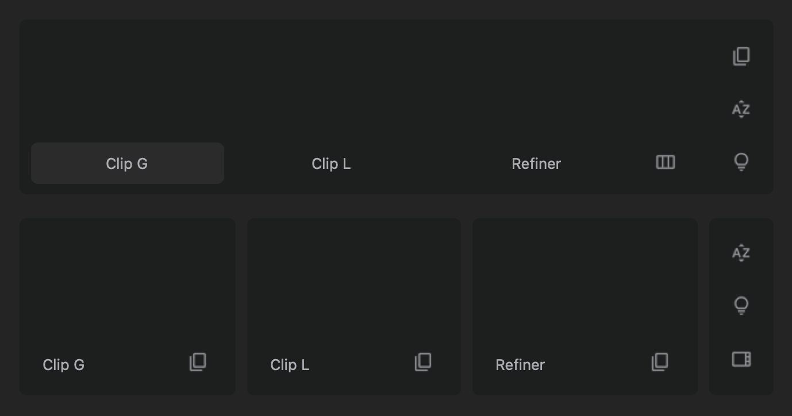

    
    <h1>SD Prompt Reader+</h1>
    
    
    
    
    
      

[简体中文](README.zh-Hans.md) | [English](README.md)

A standalone viewer and batch converter for reading the prompt from AI generated images — browse a whole folder, inspect any image, and convert batches, without a webui.
     
  

    <a href="#features">Features</a> •
    <a href="#supported-formats">Supported Formats</a> •
    <a href="#download">Download</a> •
    <a href="#usage">Usage</a> •
    <a href="#faq">FAQ</a> •
    <a href="#credits">Credits</a>
  

    

> [!NOTE]
> **SD Prompt Reader+** is an enhanced fork of [Stable Diffusion Prompt Reader](https://github.com/receyuki/stable-diffusion-prompt-reader) by [receyuki](https://github.com/receyuki), released under the MIT license. All original features are preserved — see [What's new in this fork](#whats-new-in-this-fork).

> [!TIP]
> For ComfyUI users, a separate [ComfyUI Prompt Reader Node](https://github.com/receyuki/comfyui-prompt-reader-node)
> exists upstream. It is **not** part of this fork.

## What's new in this fork
This fork keeps every original feature and adds a folder-based workflow and a batch converter.
- 📁 **Folder browsing** — open a whole folder at once and click through every image in the left **Photos** panel instead of dragging in one file at a time.
- 🔄 **Batch conversion (right panel)** — the new **Convert** panel converts a folder of images to **JPG / PNG / WEBP** and keeps the generation prompt in the metadata.
- ⏱️ **Progress and cancel** — conversions run on a background thread with a live counter and a **Cancel** button, so the window never freezes.
- ♻️ **Refresh buttons** — rescan a folder to pick up images added or removed since it was opened.
- 💾 **Remembered settings** — your last folders, export folder, format and quality options are restored on the next launch.
- 📂 **Wider input support** — BMP, GIF, TIFF and other Pillow-readable formats are accepted, including files with no extension.
- 🧱 **Robust folder scanning** — Unicode filenames, very long paths and unreadable entries no longer make a full folder look empty.

*These implement the three items from the original roadmap: batch processing, folder view and user preferences.*

## Features
- Windows only.
- Graphical interface only.
- Simple drag and drop interaction.
- Copy prompt to clipboard.
- Remove prompt from image.
- Export prompt to text file.
- Edit or import prompt to images
- Vertical orientation display and sorting by alphabet
- Detect generation tool.
- Multiple formats support.
- Dark and light mode support.
- **Folder browsing** — open a whole folder and click through every image in the left *Photos* panel.
- **Batch conversion** — convert a folder of images to JPG / PNG / WEBP from the right *Convert* panel, keeping the embedded prompt.

## Supported Formats
|                                                                                        | PNG | JPEG | WEBP | TXT* |
|----------------------------------------------------------------------------------------|:---:|:----:|:----:|:----:|
| [A1111's webUI](https://github.com/AUTOMATIC1111/stable-diffusion-webui)               |  ✅  |  ✅   |  ✅   |  ✅   |
| [Easy Diffusion](https://github.com/easydiffusion/easydiffusion)                       |  ✅  |  ✅   |  ✅   |      |
| [StableSwarmUI](https://github.com/Stability-AI/StableSwarmUI)*                        |  ✅  |  ✅   |      |      |
| [StableSwarmUI (prior to 0.5.8-alpha)](https://github.com/Stability-AI/StableSwarmUI)* |  ✅  |  ✅   |      |      |
| [Fooocus-MRE](https://github.com/MoonRide303/Fooocus-MRE)*                             |  ✅  |  ✅   |      |      |
| [NovelAI (stealth pnginfo)](https://novelai.net/)                                      |  ✅  |      |  ✅   |      |
| [NovelAI (legacy)](https://novelai.net/)                                               |  ✅  |      |      |      |
| [InvokeAI](https://github.com/invoke-ai/InvokeAI)                                      |  ✅  |      |      |      |
| [InvokeAI (prior to 2.3.5-post.2)](https://github.com/invoke-ai/InvokeAI)              |  ✅  |      |      |      |
| [InvokeAI (prior to 1.15)](https://github.com/invoke-ai/InvokeAI)                      |  ✅  |      |      |      |
| [ComfyUI](https://github.com/comfyanonymous/ComfyUI)*                                  |  ✅  |      |      |      |
| [Draw Things](https://drawthings.ai/)                                                  |  ✅  |      |      |      |
| Naifu(4chan)                                                                           |  ✅  |      |      |      |

\* Limitations apply. See [format limitations](#TXT).

> [!NOTE]
> If you are using a tool or format that is not on this list, please help by uploading the original file
> generated by your tool to the issues, thanks.

## Download
### For Windows users
Download the executable from [GitHub Releases](https://github.com/Abdulrhman-0/SD-Prompt-Reader-plus/releases/latest).
Unzip the archive and run **SD Prompt Reader+.exe**.

> [!NOTE]
> This fork ships a **Windows** build only. No installation is required - the executable is
> self-contained and does not need Python.

## Usage
### Read prompt
- Open the executable file (.exe) and drag and drop the image into the window.

OR
- Right click on the image and select "Open with" > SD Prompt Reader+

OR
- Drag and drop the image directly onto the executable (.exe).

### Browse a folder

The left **Photos** panel lists every image in a folder so you do not have to open them one by one.
- Click **Add Folder** in the **Photos** panel and choose a folder. Every supported image inside it (including sub-folders) is listed.
- Click any name in the list to display that image and its prompt.
- Click **Refresh** to rescan the folder after images were added or removed.
- The panel title shows how many images were found.

### Convert photos (right panel)

The right-hand **Convert** panel batch-converts a folder of images to **JPG**, **PNG** or **WEBP**.

> [!IMPORTANT]
> **The prompt is preserved.** This is what sets it apart from ordinary image converters.
> A normal converter re-encodes the image and drops the generation metadata, so the prompt is
> lost for good. This converter writes the prompt into the converted file, so it stays readable
> afterwards.

Why you would want this:
- **Free up disk space.** AI image folders grow fast. Convert heavy PNGs into compressed JPG or
  WEBP and keep the prompt, even with thousands of large files.
- **Change the file format.** Turn a folder of PNGs into JPG/WEBP (or back) without losing the prompt.
- **Shrink before sharing.** Lower the quality slider to make files small enough to upload, while
  the prompt still travels with them.

How to use it:
- Click **Add Folder** to choose the folder to convert, or leave it empty to use the folder open in the **Photos** panel.
- Choose the export folder and the target format, then adjust the quality / compression options.
- Click **Convert**. A live counter shows progress and the button becomes **Cancel** while the batch runs, so the window stays responsive.
- Click **Refresh** to rescan the folder if images were added or removed.
- Converted files keep their prompt metadata, so they are still readable afterwards.

### Export prompt to a text file
- Click "Export" will generate a txt file alongside the image file.
- To save to another location, click the expand arrow and click "select directory".  

### Remove prompt from image
- Click "Clear" will generate a new image file with suffix "_data_removed" alongside the original image file.
- To save to another location, click the expand arrow and click "select directory".
- To overwrite the original image file, click the expand arrow and click "overwrite the original image".  

### Edit image
> [!NOTE]
> The edited image will be written in A1111 format, meaning that image in any format 
> will become A1111 format after editing.

- Click "Edit" to enter edit mode.
- Edit the prompt directly in the textbox or import a metadata file in txt format.
- Click "Save" will generate a edited image file with suffix "_edited" alongside the original image file.
- To save to another location, click the expand arrow and click "select directory".
- To overwrite the original image file, click the expand arrow and click "overwrite the original image".  

### Copy as single line prompt
Copy image prompt and setting in a format that can be read by [Prompts from file or textbox](https://github.com/AUTOMATIC1111/stable-diffusion-webui/wiki/Features#prompts-from-file-or-textbox) 
The following parameters are supported:

| Setting                 | Parameter            |
|-------------------------|----------------------|
| Seed                    | --seed               |
| Variation seed strength | --subseed_strength   |
| Seed resize from        | --seed_resize_from_h |
| Seed resize from        | --seed_resize_from_w |
| Sampler                 | --sampler_name       |
| Steps                   | --steps              |
| CFG scale               | --cfg_scale          |
| Size                    | --width              |
| Size                    | --height             |
| Face restoration        | --restore_faces      |

- Click the expand arrow and click "single line prompt".
- Paste it into the textbox below the webui script "Prompts from file or textbox".  

### ComfyUI SDXL workflow
> [!NOTE]
> The SDXL workflow does not support editing. 
> If necessary, please remove prompts from image before edit. 

If the image's workflow includes multiple sets of SDXL prompts, 
namely Clip G(text_g), Clip L(text_l), and Refiner, the SD Prompt Reader will switch to the multi-set prompt display mode as shown in the image below. 
There are two interface options available for the multi-set prompt display mode, and you can switch between them using buttons.  

## Format Limitations
### TXT
1. Importing txt file is only allowed in edit mode.
2. Only A1111 format txt files are supported. You can use txt files generated by the A1111 webui or use the SD prompt reader to export txt from A1111 images
### StableSwarmUI
> [!IMPORTANT]
> StableSwarmUI is still in the Alpha testing phase, and its format may change in the future. I will keep track of upcoming updates of StableSwarmUI.
### ComfyUI
> [!IMPORTANT]
> When custom nodes are used or when the workflow becomes overly complex, there is a high probability that metadata may not be correctly read. 
> This is because ComfyUI does not store metadata but only the complete workflow. This app can only handle basic workflows.

1. If there are multiple sets of data (seed, steps, CFG, etc.) in the setting box, this means that there are multiple KSampler nodes in the flowchart.
2. Due to the nature of ComfyUI, all nodes and flowcharts in the workflow are stored in the image, including those that are not being used. Also, a flowchart can have multiple branches, inputs and outputs.
(e.g. output hires. fixed image and original image simultaneously in a single flowchart)
SD Prompt Reader will traverse all flowcharts and branches and display the longest branch with complete input and output.  
3. [ComfyUI SDXL workflow](#comfyui-sdxl-workflow)
### Easy Diffusion
By default, Easy Diffusion does not write metadata to images. Please change the _Metadata format_ in settings to _embed_ to write the metadata to images
### Fooocus-MRE
Since the original version of [Fooocus](https://github.com/lllyasviel/Fooocus) does not support writing metadata to image files, 
SD Prompt Reader only supports images generated by [Fooocus MoonRide Edition](https://github.com/MoonRide303/Fooocus-MRE).

## FAQ
### Malware Alert
> [!WARNING]
> Some antivirus tools may report a false positive. This is caused by the packaging tool
> _PyInstaller_, which is a well-known issue for _PyInstaller_ users, and not by anything the app
> actually does. You can review the source in this repository, or upload the executable to
> [VirusTotal](https://www.virustotal.com/) if you would like to verify it.

## TODO
The original roadmap is now complete in this fork:
- ~~Batch image processing tool~~ ✅ *(the right-hand **Convert** panel)*
- ~~Gallery/Folder view~~ ✅ *(the left-hand **Photos** panel)*
- ~~User preference~~ ✅ *(settings are remembered between sessions)*

## Credits
- **This fork** — maintained as *SD Prompt Reader+*. Folder browsing and the batch converter are additions to the original project.
- Original project: [Stable Diffusion Prompt Reader](https://github.com/receyuki/stable-diffusion-prompt-reader) by [receyuki](https://github.com/receyuki), MIT licensed.
- Inspired by [Stable Diffusion web UI](https://github.com/AUTOMATIC1111/stable-diffusion-webui/)
- App icon generated using Stable Diffusion with [IconsMI](https://huggingface.co/jvkape/IconsMI-AppIconsModelforSD)
- Special thanks to [Azusachan](https://github.com/Azusachan) for providing SD server
- The NovelAI stealth pnginfo parser is based on [the official metadata extraction script of NovelAI](https://github.com/NovelAI/novelai-image-metadata)
